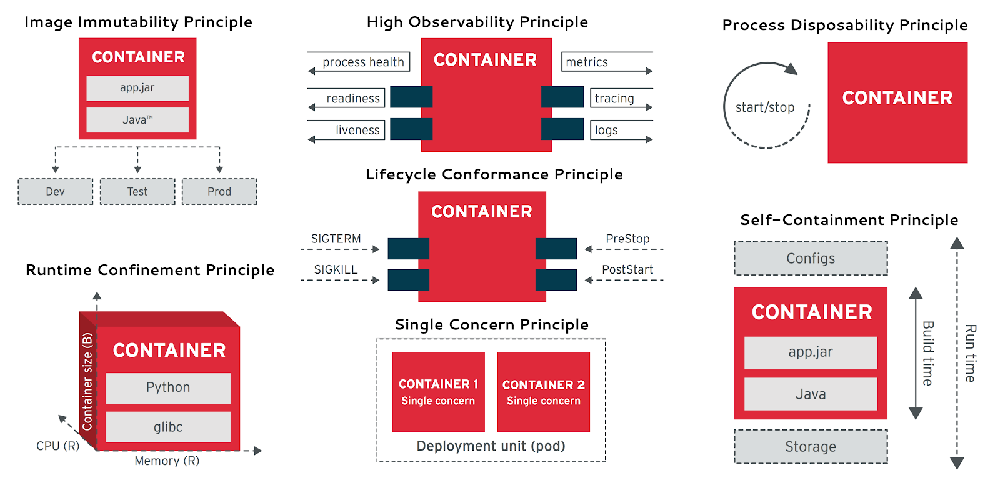

# Cloud Native Container Design

## Build Time

- Single Concern

Each container addresses a single concern and does it well.

- Self-Containment

A container relies only on the presence of the Linux kernel. Additional
libraries are added when the container is built.

- Image Immutability

Containerized applications are meant to be immutable, and once built are not
expected to change between different environments.

## Runtime

- High Observability

Every container must implement all necessary APIs to help the platform observe
and manage the application in the best way possible.

- Lifecycle Conformance

A container must have a way to read events coming from the platform and conform
by reacting to those events.

- Process Disposability

Containerized applications must be as ephemeral as possible and ready to be
replaced by another container instance at any point in time.

- Runtime Confinement

Every container must declare its resource requirements and restrict resource use
to the requirements indicated. The build time principles ensure that containers
have the right granularity, consistency, and structure in place. The runtime
principles dictate what functionalities must be implemented in order for
containerized applications to possess cloud-native function. Adhering to these
principles helps ensure that your applications are suitable for automation in
Kubernetes.
