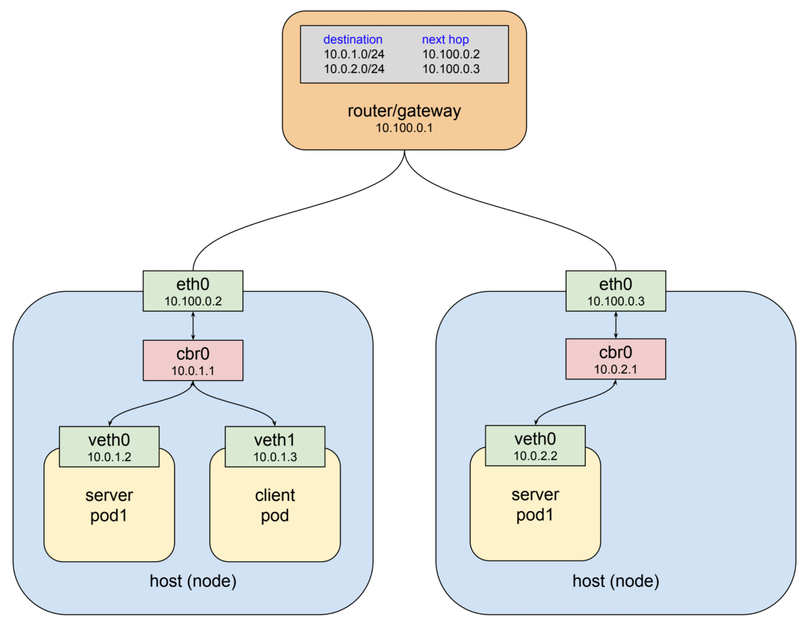
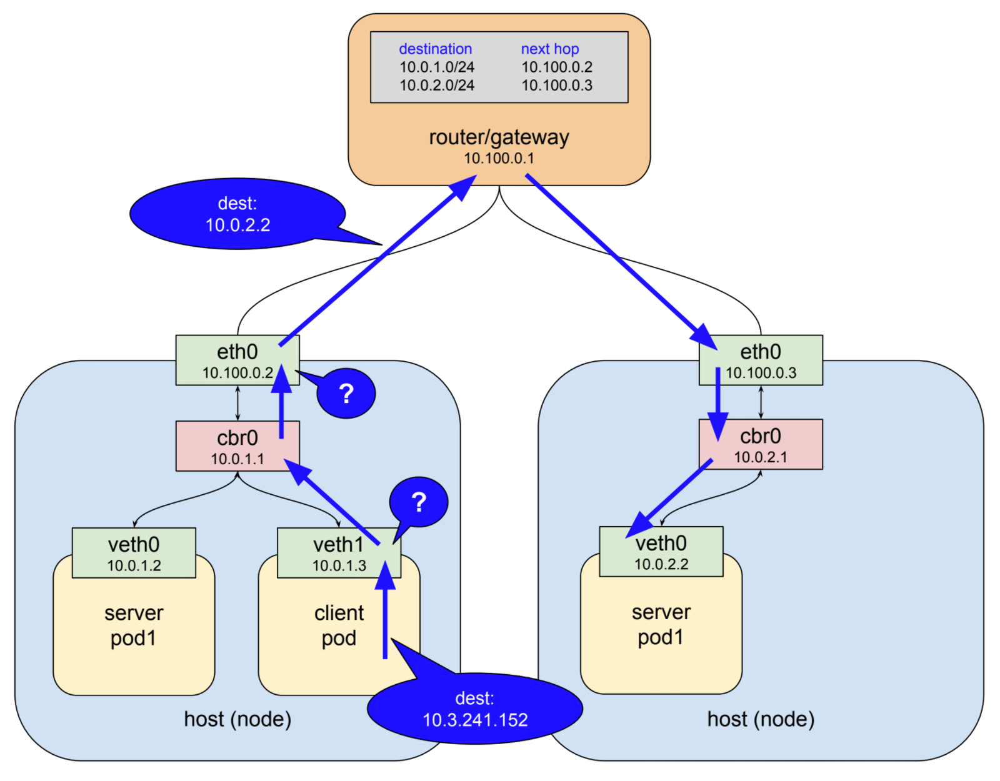

# Understanding Kubernetes Networking

## kubernetes requirements on any networking implementation

1. Any Pod can communicate with any other Pod without the use of network address
   translation (NAT). To facilitate this, Kubernetes assigns each Pod an IP
   address that is routable within the cluster.

2. A node can communicate with a Pod without the user of NAT.

3. A Pod's awareness of its address is the same as how other resources see the
   address. The host's address doesn't mask it.

- compatible with vm

this model is not only less complex overall, but it is principally compatible
with the desire for kubernetes to enable low-friction porting of apps from vms
to containers. if your job previously ran in a vm, your vm had an ip and could
talk to other vms in your project. this is the same basic model.

- ip-per-pod

kubernetes ip addresses exist at the pod scope - containers within a pod share
their network namespaces - including their ip address. this means that
containers within a pod can all reach each other’s ports on localhost. this also
means that containers within a pod must coordinate port usage, but this is no
different from processes in a vm. this is called the “ip-per-pod” model.

## 3-kind networking

- infrastructure network

the network your physical (or virtual) machines are connected to. normally your
production network, or a part of it.

- pod network

this is the network, which is used by the pods. however it is not a simple
network either, depending on what kubernetes network solution you are employing.
if you are using flannel, then this would be a large software defined overlay
network, and each worker node will get a subnet of this network and configured
for it's docker0 interface (in very simple words, there is a little more to it).
if you are employing cidr network, using cni, then it would be a large network
called cluster-cidr, with small subnets corresponding to your worker nodes to
these small subnets. this is proved to be a challenge on aws vpc router, but
this is piece of cake on a simple/generic router in your network.

- service network

the (completely) virtual (rather fictional) network, which is used to assign ip
addresses to kubernetes services, which you will be creating. (a service is a
frontend to rc or a deployment). it must be noted that ip from this network are
never assigned to any of the interfaces of any the nodes/vms, etc. these
(service ips) are used behind the scenes by kube-proxy to create (weird)
iptables rules on the worker nodes.

1. ClusterIP

2. NodePort

## /etc/resolv.conf

- nameservers

a list of IP addresses that will be used as DNS servers for the Pod. There can
be at most 3 IP addresses specified. When the Pod's dnsPolicy is set to "None",
the list must contain at least one IP address, otherwise this property is
optional. The servers listed will be the base nameservers generated from the
specified DNS policy with duplicate addresses removed.

- searches

a list of DNS search domains for hostname lookup in the Pod. This property is
optional. When specified, the provided list will be merged into the base search
domain names generated from the chosen DNS policy. Duplicate domain names are
removed. Kubernetes allows for at most 6 search domains.

- options

an optional list of objects where each object may have a name property
(required) and a value property (optional). The contents in this property will
be merged to the options generated from the specified DNS policy. Duplicate
entries are moved.

## /etc/hosts

static table lookup for hostnames

`man hosts`

## /etc/nsswitch.conf

Name Service Switch configuration file

`man nsswitch.conf`
