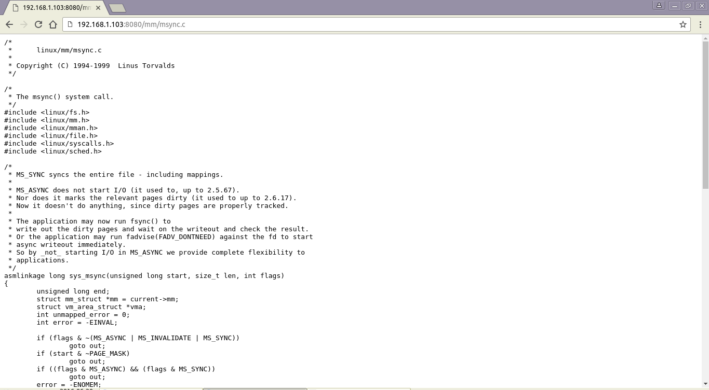

# python

### Fast file sharing between two hosts

> python -m SimpleHTTPServer 8080

```
[lockrecv@thinkpad lockrecv]$ python -m SimpleHTTPServer 8080
Serving HTTP on 0.0.0.0 port 8080 ...
```



```
[lockrecv@thinkpad lockrecv]$ wget http://192.168.1.103:8080/mm/msync.c
--2016-06-20 20:17:22--  http://192.168.1.103:8080/mm/msync.c
Connecting to 192.168.1.103:8080... connected.
HTTP request sent, awaiting response... 200 OK
Length: 2478 (2.4K) [text/plain]
Saving to: 'msync.c'

msync.c    100%[==================================>]   2.42K  --.-KB/s    in 0s

2016-06-20 20:17:22 (229 MB/s) - 'msync.c' saved [2478/2478]
```

```
[lockrecv@thinkpad linux]$ python -m SimpleHTTPServer 8080
Serving HTTP on 0.0.0.0 port 8080 ...
192.168.1.103 - - [20/Jun/2016 20:16:53] "GET /mm/msync.c HTTP/1.1" 200 -
192.168.1.103 - - [20/Jun/2016 20:17:01] "GET /mm/msync.c HTTP/1.1" 200 -
192.168.1.103 - - [20/Jun/2016 20:17:22] "GET /mm/msync.c HTTP/1.1" 200 -
```

### Json pretty

> echo '{"agent": "chrome", "os": "linux"}' | python -m json.tool

```
{
    "agent": "chrome",
    "os": "linux"
}
```
